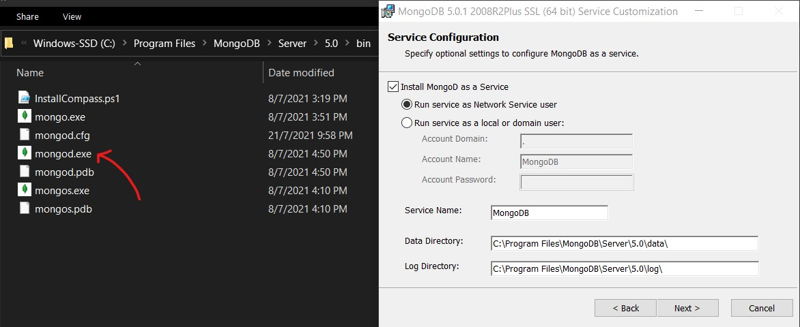

# Description
This is a technical test to implement a RESTful API to help tournament organizers with generating tournament brackets in pdf.

# Getting started
### Prerequisite dependencies
Download and install relevant **Git** version (https://git-scm.com/downloads) for your system and follow the default setup instruction, if you have not already installed it on your machine.

Then check if **Node.js** is installed on your local machine or not, by running the following command in git bash or command prompt :
```sh
node --version
```
*If `npm command not found` shows up, go to https://nodejs.org/en/ to download the latest LTS version for your machine, then add Node.js to PATH and restart computer.

Another tool needed is **MongoDB Community Sever (version 5.0.1)** which can be downloaded from https://www.mongodb.com/try/download/community. During installation, click the 'Complete' option in 'Choose setup type' panel and take note of the 'Data Directory', we will be using the mongod.exe in `C:\Program Files\MongoDB\Server\5.0\bin` if you follow the default path :



### Running Server Locally
1. Start the MongoDB server by running `mongod.exe` in `C:\Program Files\MongoDB\Server\5.0\bin` if you follow the default installation path, if not, go to your designated installation path. Then leave the terminal aside.
2. Git clone the project by running the following command in git bash :
	`git clone https://github.com/syong9295/Playbookx-API-test.git`
3. Navigate to the project root directory `Playbookx-API-test`
4. Run `npm install` to install all the npm dependencies needed for this project.
5. Run `node app.js` (make you are in the project root directory first)

### API Instructions
Once you have run `node app.js`, open your browser and try typing the following API urls / routes to access different functionalities :

| API route / url | Description |
| :----------- | :----------- |
| `http://localhost:3000/tournaments`| access all sample data |
| `http://localhost:3000/tournaments/id/<round_id>` | access the particular data with that specific round id     |
| `http://localhost:3000/tournaments/round/<round>` | access the particular data with in specific round |
| `http://localhost:3000/tournaments/stage/<stage>` | access all sample data in that specific stage |
| `http://localhost:3000/tournaments/download` | download the formatted tournament bracket in pdf format |
